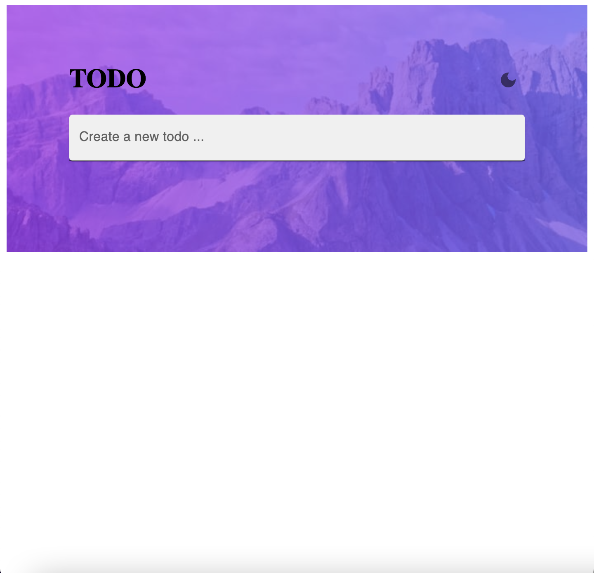
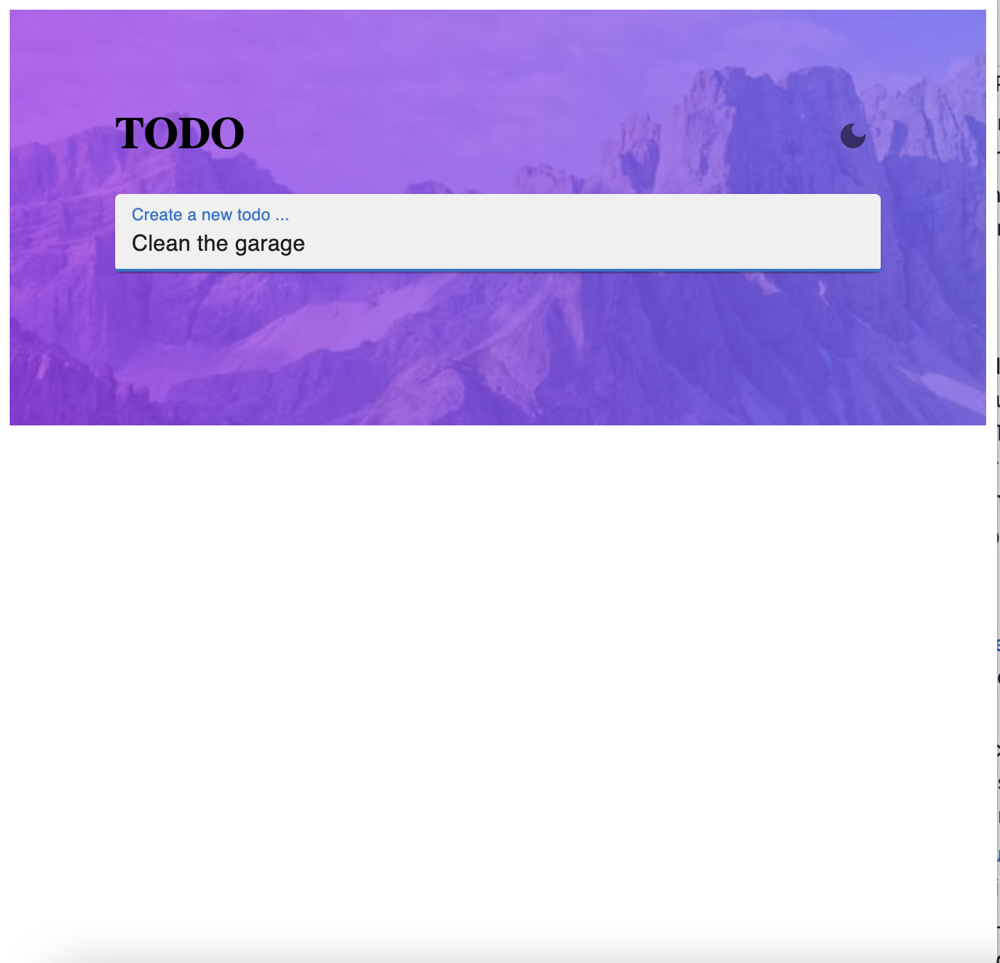
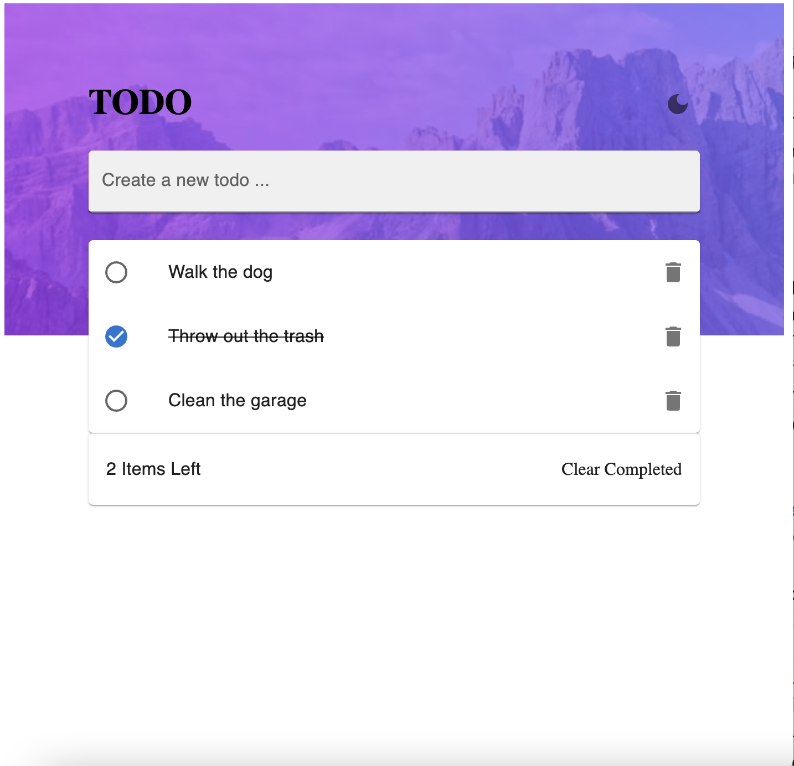
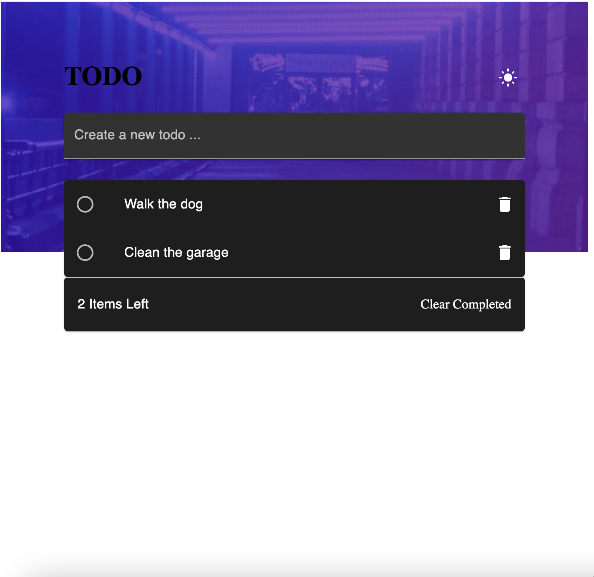

# React Todo Application
> A todo web application created in React.
> Live demo [_here_](https://affectionate-snyder-a0d9c4.netlify.app/). <!-- If you have the project hosted somewhere, include the link here. -->

## Table of Contents
* [General Info](#general-information)
* [Technologies Used](#technologies-used)
* [Features](#features)
* [Screenshots](#screenshots)
* [Setup](#setup)
* [Usage](#usage)
* [Project Status](#project-status)
* [Acknowledgements](#acknowledgements)
* [Contact](#contact)
<!-- * [License](#license) -->

## General Information
- I created this project using React. For the styling I used a combination of  MaterialUI and styled-components.
- I created this project to practice creating CRUD(CREATE-READ-UPDATE-DELETE) applications.
- Challenges I faced.
  - Initially I had trouble marking individual tasks as completed and deleting individual tasks.
  - I learned that assigning and using unique a ID can help specify which tasks you would like to interact with.
<!-- You don't have to answer all the questions - just the ones relevant to your project. -->

## Technologies Used
- React - version 17.0.2
- styled-components - version 5.3.3
- MaterialUI - version 5.0.3

## Features
List the ready features here:
- Add a todo
- Mark a todo as completed
- Delete a todo
- Display all uncompleted todos
- Clear Completed todos
- Enable Dark Mode on the application
- Responsive Design

## Screenshots

<!-- If you have screenshots you'd like to share, include them here. -->

## Setup
How to install the project.
1. `cd react-todo-application-main`
2. `npm i`

## Usage
How does one go about using it?
- `npm start`
- The application should open on your local host on your default web browser.
- To close the application enter `ctrl+c`.

## Project Status
Project is: _complete_ 

## Acknowledgements
Give credit here.
- This project was inspired by [Frontend Mentor](https://www.frontendmentor.io/home).
<!-- This project was based on [this tutorial](https://www.example.com). -->

## Contact
Created by [@javi](https://javiermelendrez.com/) - feel free to contact me!
